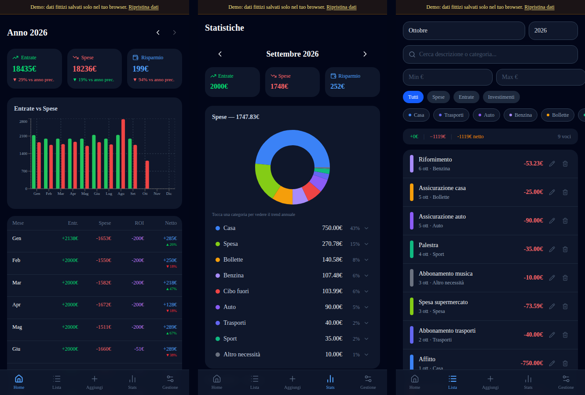

# Cash Registry

A personal finance tracker for income, expenses and investments, built with Next.js and Supabase. It is designed mobile-first and can be installed on the phone as a PWA.

**[Live demo](https://bossforcoding.github.io/cash-registry/)** (demo mode, fictional data)



## Features

- **Dashboard:** yearly income vs expenses chart, month-by-month table and comparison with the previous year
- **Transactions:** add, edit and delete transactions; filter by month, type, category and amount range; search by description or category
- **Statistics:** monthly spending breakdown by category, with the yearly trend of each category
- **Fixed expenses:** recurring entries (rent, salary, subscriptions…) that can be applied to a month in one tap
- **Custom categories:** create, rename and recolor categories for expenses, income and investments
- **Excel import:** script to import historical data from a spreadsheet
- **Installable PWA** with a dark, mobile-first interface

## Demo mode

When no Supabase credentials are configured, the app runs in **demo mode**: it uses fictional sample data stored in the browser's `localStorage` instead of a database. Changes stay in your browser and can be reset from the banner at the top. This is how the public demo runs.

## Getting started

Requires Node.js 20 or later.

```bash
npm install
npm run dev
```

Open http://localhost:3000. Without further configuration the app starts in demo mode.

### Connect a Supabase database

1. Create a project on [Supabase](https://supabase.com).
2. In the SQL editor, run the scripts in `supabase/` in this order: `schema.sql`, `categories_schema.sql`, `fixed_expenses_schema.sql`, `add_category_description.sql`, `add_fixed_expense_note.sql`, `add_settings_table.sql`.
3. Copy `.env.example` to `.env.local` and fill in the project URL and anon key (Project Settings > API).
4. Restart `npm run dev`.

> **Security note:** the included SQL policies allow full access with the anon key, which is fine for local use only. The app has no login, so before deploying it with a real database, add [Supabase Auth](https://supabase.com/docs/guides/auth) and restrict the row-level security policies to the authenticated user.

### Deploy

The app is exported as a static site (`output: "export"`), so it can be hosted anywhere. `./deploy-demo.sh` builds the demo and publishes it to GitHub Pages.

### Import from Excel

```bash
node scripts/import-excel.mjs path/to/file.xlsx
```

The workbook is expected to have the sheets `ELENCO SPESE`, `ELENCO ENTRATE` and `ELENCO INVESTIMENTI`.

## Tech stack

Next.js · React · TypeScript · Tailwind CSS · shadcn/ui · Recharts · Supabase

## License

[MIT](LICENSE)
